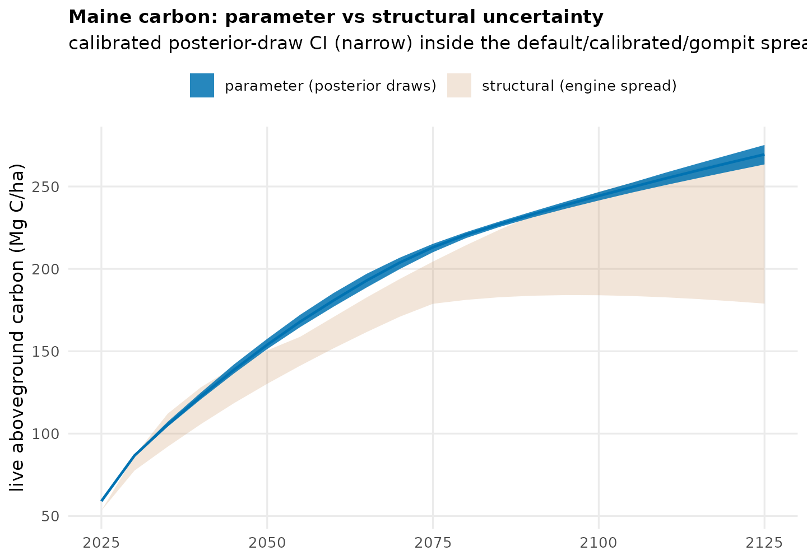

# Bayesian posterior-draw carbon uncertainty (parameter layer)

Propagates the calibration's Bayesian posterior draws through the FVS projection
to get a parametric carbon CI -- the parameter-uncertainty layer, distinct from
the plot-sampling CI and the structural (engine-spread) band.

## How

`fvs_posterior_uncertainty.py` loads a variant's posterior draws
(`config/calibrated/<variant>_draws.json`, 500 draws x 6 components, joint
correlation preserved) and, per draw, injects the draw's parameters through the
standard projection by monkeypatching `FvsConfigLoader.generate_keywords` to
return `UncertaintyEngine.generate_keywords_for_draw(...)` -- so the existing
`config_version="calibrated"` keyfile path carries the draw, with **no change to
production code**. Single-draw mode (`--draw-idx`) parallelizes one SLURM array
task per draw; the per-draw state-mean densities are then percentiled into a CI.

Validated end-to-end on Maine (variant ne): 30 posterior draws x 60-plot
subsample, one array task per draw, ~15 min wall.

## Result (Maine, calibrated engine, live AGC density Mg C/ha)

| year | mean | 95% CI | CI width |
|------|-----:|-------:|---------:|
| 2030 | 86.7 | 86.2 - 87.4 | 1.4% |
| 2055 | 168.0 | 164.7 - 172.2 | 4.5% |
| 2080 | 220.7 | 218.7 - 222.3 | 1.6% |

## The headline finding

**Parameter uncertainty is small** (1 to 5% CI width) because the posteriors are
tightly constrained by national FIA remeasurement data. It is far narrower than
the **structural uncertainty** -- the default / calibrated / gompit engines
diverge by 30 to 60% in late succession (the mortality formulation dominates).
So for these projections the dominant uncertainty is the *choice of model*, not
the calibrated parameters. The figure shows the narrow parameter CI sitting
inside the wide engine spread.

This reframes the dashboard's uncertainty story: the honest band to show is the
engine spread (structural), with the posterior CI as a thin inner ribbon on the
calibrated curve.

## Scaling out

The pipeline is a SLURM array over (state, variant, draw). To extend: run the
FIA-anchored states on their dominant calibrated variant (GA/sn, IN/cs, MN/ls,
ID/ie, OR/wc, WA/wc), both scenarios, then merge the calibrated-engine inner CI
onto the dashboard. Only calibrated variants carry posteriors, so the parameter
CI attaches to the calibrated engine. Pipeline: `fvs_posterior_uncertainty.py`
(`--draw-idx` array) -> per-draw CSVs -> percentile aggregation -> CI.
