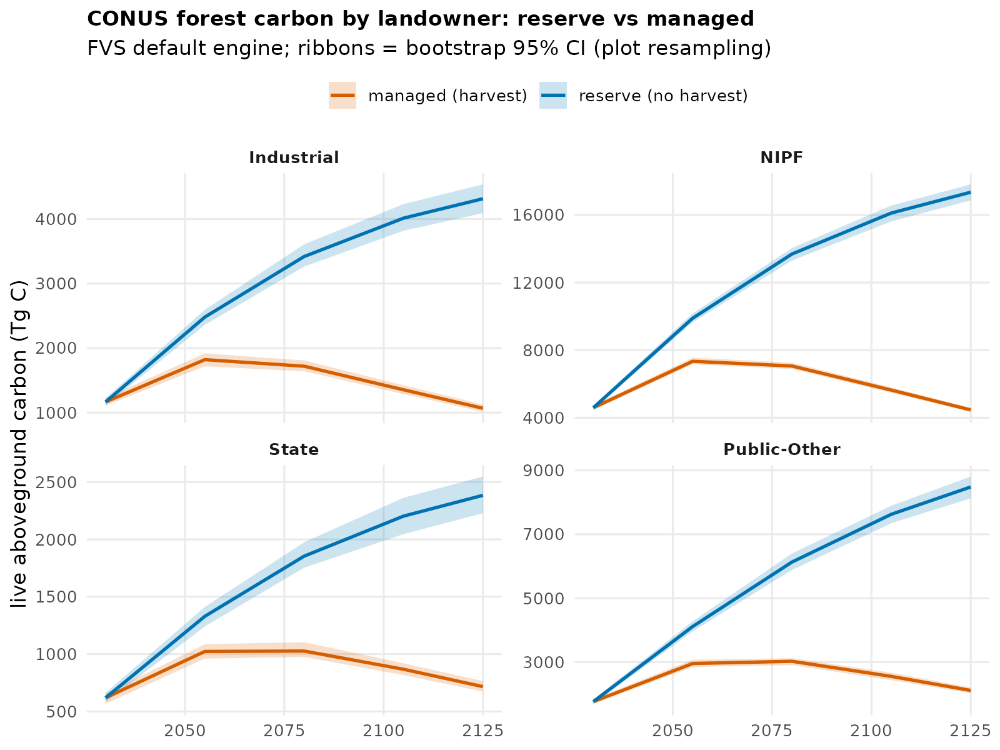

# Landowner / ecoregion / state carbon trends across scenarios (with uncertainty)

`fvs_strata_trends.py` joins the FVS per-plot trajectories to the ycx strata
membership (`owner4` = Industrial / NIPF / State / Public-Other; `prov_name` =
EPA Level III ecoregion) and the TreeMap per-plot area, then aggregates
area-weighted live carbon by landowner, ecoregion, and state, for both scenarios
(reserve no-harvest, managed harvest+disturbance) and each engine. Uncertainty is
a bootstrap 95% CI from resampling plots within each stratum (B = 200).

## Landowner (CONUS, default engine, Tg C; 2030 -> 2125)

| owner | reserve | managed |
|-------|--------:|--------:|
| NIPF (family/other private) | 4,595 -> 17,347 | 4,595 -> 4,463 |
| Public-Other (federal etc.) | 1,763 -> 8,480 | 1,763 -> 2,112 |
| Industrial (corporate) | 1,165 -> 4,315 | 1,165 -> 1,068 |
| State | 619 -> 2,385 | 619 -> 717 |

Reserve is the no-harvest upper bound (every class over-accumulates). Under the
data-driven managed regime, private lands (NIPF, Industrial) hold near their 2030
standing carbon -- harvest offsets growth at a working-forest steady state --
while public and state lands, which carry lower harvest rates, still accumulate
modestly. NIPF dominates the national total (~half the forest). See figure.

Output `strata_trends_<engine>.csv` carries all three scales (owner / ecoregion /
state) x 2 scenarios x 5 years with `total_TgC`, `total_lo/hi` (95% CI), and
`mean_MgC_ha`. Ecoregion (87 EPA L3 provinces) and state breakdowns are in the
same file. Rerun per engine with `--config` for the calibrated / gompit brackets.

## Note on uncertainty layers

Two distinct uncertainties are available and complementary:
1. **Sampling** (computed here): plot-resampling CI on each stratum total.
2. **Structural / model**: the spread across the three engines (default vs
   calibrated vs gompit) -- the divergence is itself a model-uncertainty band,
   widest in late succession where mortality assumptions dominate.
A full Bayesian posterior-draw uncertainty (the 500-draw UncertaintyEngine) is a
further layer, listed under next steps.

## Regenerate on the height-corrected campaign

These numbers are from the v2 campaign (2030-anchored). The height-imputed rerun
(`out_fvs_v3` / `out_gompit_v3`, treeinit_h) is in flight; rerun this script
against it for the final 2025-anchored trends.
