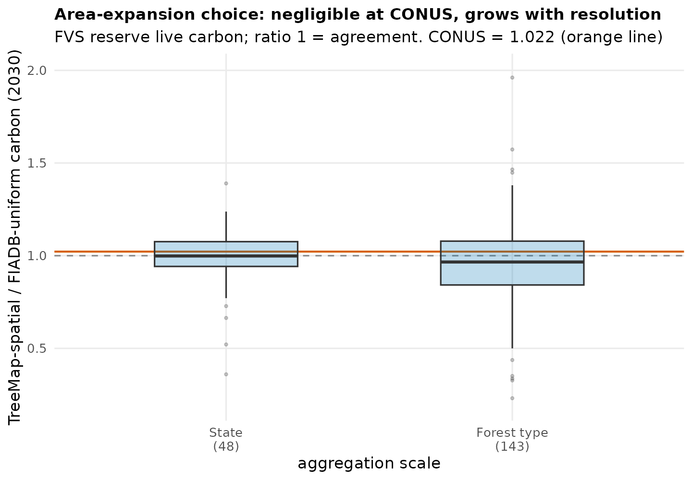

# CONUS TreeMap spatially-explicit FVS, and FIADB vs TreeMap across scales

Scales the Maine TreeMap pilot to the full CONUS. The v2 FVS campaign already
projected every FIA plot (keyed `STAND_CN` = `PLT_CN`); TreeMap2022 imputes each
plot across the forest landscape, and its raster attribute table gives the pixel
`Count` per `PLT_CN`, hence the actual area each plot represents. No billion-pixel
raster scan is needed: the per-plot CONUS area is a table aggregation over the
VAT (`plt_area_treemap.csv`, 65,043 donor plots, 241.9 Mha total, matching the
CONUS forest area).

## Cross-validation against TreeMap's own carbon

Expanding the FVS 2030 standing live carbon by TreeMap pixel area gives
**9,284 Tg C**, within **9%** of TreeMap's independent imputed live carbon
(`CARBON_L`) over the same area (10,151 Tg C, ratio 0.91). Two independently
built products (corrected-treeinit FVS vs TreeMap's imputation) agree to ~9% at
the continental scale; the residual is partly the 2025/2030 height-fill artifact,
which closes by 2035. This is a strong check on the corrected FVS biomass.

## FIADB vs TreeMap: the area-expansion choice across scales

The same FVS per-plot carbon, expanded two ways (`fvs_treemap_conus_compare.py`):

* **TreeMap (spatial)**: sum over plots of density x actual pixel area.
* **FIADB (uniform)**: mean density x total area (every plot weighted equally).

Both cover the same total area; they diverge only where a plot's carbon density
correlates with how much area TreeMap assigns it. The divergence is strongly
**scale-dependent**:

| scale | TreeMap / FIADB (2030) |
|-------|---|
| CONUS | 1.00 to 1.02 (negligible) |
| State (48) | median 1.00, IQR 0.94 to 1.08, range **0.36 to 1.39** |
| Forest type (143) | median 0.97, range **0.23 to 1.96** |

At the continental aggregate the choice washes out (high- and low-biomass areas
average out). It grows as resolution increases: states where high-biomass types
occupy disproportionate area run high (IN 1.39, WV 1.24, TN 1.22, VA 1.21 -- the
eastern hardwoods), while sparse/woodland states run low (ND 0.36, NV 0.52, MT
0.66, CA 0.77). At the forest-type stratum the spread is widest. The ratio also
converges toward 1.0 over the century as stands mature toward carrying capacity
(seen in the ME pilot). TreeMap reveals a spatial composition effect that FIADB
plot-expansion cannot resolve, and it matters precisely when the question is
sub-state or by forest type.

## Pipeline

`plt_area_treemap.csv` (VAT aggregation) -> `fvs_treemap_conus_compare.py`
(`out_fvs_v2` x area, state / forest-type / CONUS, 2030/2075/2125) ->
`fvs_treemap_vs_fiadb.csv` + `fig_treemap_conus.R`. Cheap and repeatable; rerun
for calibrated / gompit by `--config`.

## Use

For statewide dashboard totals the two area models agree closely enough that the
FIADB-anchored merge already in production is sound at state scale. TreeMap
spatial expansion is the right basis for sub-state, county, or forest-type
reporting, where the uniform assumption breaks down.
