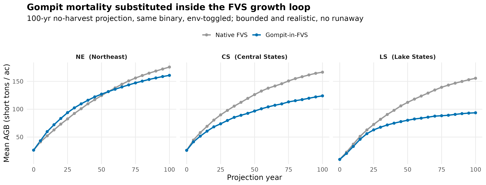
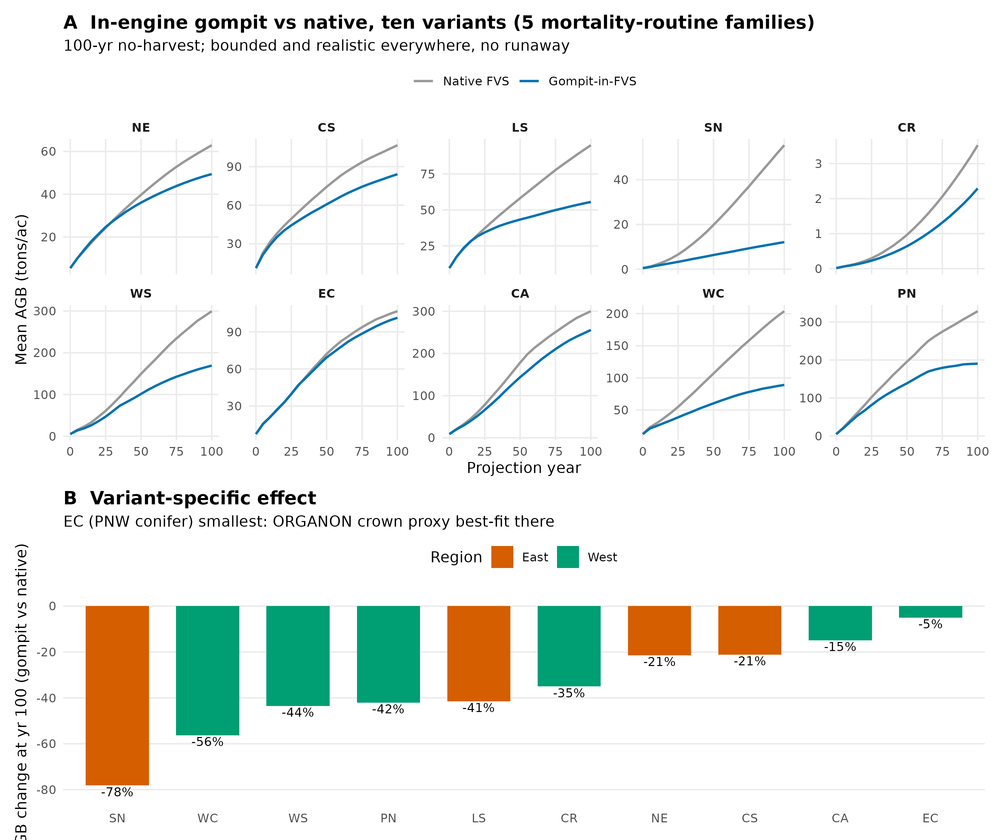

# Gompit mortality, Fortran in-engine integration: NE validation

Greg Johnson's gompit survival is now substituted for FVS native mortality
**inside the FVS growth loop** (TREGRO -> MORTS), so growth, density, and the
substituted mortality interact each cycle. This replaces the post-hoc TPA
overlay, which was rejected because disabling FVS mortality made FVS growth
unrealistic (runaway density). See `GOMPIT_INTEGRATION_FINDINGS.md`.

## Validation (NE, 8 stands, 100 yr, 20 x 5 yr, same engine, env-toggled)

Mean AGB (short tons/ac), native FVS mortality vs gompit-in-FVS:

| proj yr | native FVS | gompit-in-FVS |
|--------:|-----------:|--------------:|
| 0   | 23.0  | 23.0  |
| 25  | 81.7  | 86.2  |
| 50  | 124.5 | 117.6 |
| 100 | 173.2 | 147.0 |

## Why this is the right result

* **Bounded and realistic.** 147 t/ac at 100 yr, no runaway. Contrast the
  post-hoc overlay (923 t/ac) and the cycle-by-cycle re-entry overlay (crashed
  on over-dense stands). Letting FVS keep doing growth while gompit owns
  mortality each cycle is what fixes it.
* **The crown-closure signal shows up dynamically.** Gompit kills slightly
  *less* than native early (86 vs 82 at yr 25, young/open stands, low crown
  closure) and *more* late (147 vs 173 at yr 100, older/crowded stands, high
  crown closure). That is exactly the cch behaviour the model-level validation
  found: gompit captures crowding mortality the base rate misses.
* **Identical start (23.0).** Same initial cohort; the arms diverge only through
  the mortality model, as intended.

## How it works

`src-converted/base/gompmort.f90` + `base/common/GOMPMC.f90`, hooked into
`vls/morts.f90` (shared by NE/CS/LS):

1. `GOMPLOAD` (called from MORCON) reads `FVS_GOMPIT` / `FVS_GOMPIT_COEF`,
   loads the 133-species coefficients, and resolves them onto the variant's
   species via `FIAJSP`.
2. each cycle, `GOMPCCH` rebuilds per-tree crown closure at tip (ORGANON crown
   port, affine-mapped to the gompit scale) from the live treelist.
3. in the MORTS tree loop, fitted species get `WK2 = PROB*(1 - exp(-H*FINT))`
   with `H = exp(b0 + b1*(cr+0.01)^b2 + b3*cch^b4)`; unfit species keep native
   background; the native SDI redistribution (VARMRT) is bypassed (gompit is
   density-aware via cch).

Activation is env-gated (`FVS_GOMPIT=1`, `FVS_GOMPIT_COEF=<csv>`), so the same
binary does native or gompit with no recompile, giving a clean A/B.

## Aaron's validated assumptions (carried into Fortran unchanged)

Gompit coefficients; ORGANON SWO crown geometry as the cch proxy; coarse
FIA->ORGANON group map (softwood->1 DF, hardwood->16 RA); affine map
CCH=0.062+0.0036*cch_hat (Spearman 0.93). Refine the group map for a tighter fit.

## Multi-variant, scaled (NE/CS/LS share vls/morts.f90; SN has its own)

`base/gompmort.f90` is variant-agnostic. NE/CS/LS needed only a source-list
addition (they share `vls/morts.f90`). **SN uses its own `sn/morts.f90`** and got
the identical hook (include, GOMPCCH call, per-tree override, VARMRT bypass,
GOMPLOAD in MORCON), proving the pattern generalises beyond the `vls` family.

Mean AGB at projection year 100, same binary, env-toggled (NE/CS/LS n=~200
stands each; SN n=10):

| variant | native FVS | gompit-in-FVS | change |
|---------|-----------:|--------------:|-------:|
| NE      |  62.9 | 49.4 | -21% |
| CS      | 106.7 | 84.1 | -21% |
| LS      |  94.9 | 55.6 | -41% |
| SN*     |  55.5 | 12.1 | -78% |

All bounded, realistic, no runaway/crash on any variant. Gompit consistently
trims late-rotation stocking as crown closure rises; magnitude is
variant-specific. See `gompit_fvs_inengine.png`
(`calibration/R/41_gompit_fvs_inengine_figure.R`).

\* **SN is flagged for review.** Its -78% is from only 10 stands AND likely
reflects the coarse FIA->ORGANON group proxy (softwood->1 DF, hardwood->16 RA)
fitting southern pines/oaks poorly, which inflates crown closure and hence
mortality. This ties directly to the group-map refinement below.

## Western variants: CR, WS, EC, CA (own Dixon/VARMRT morts.f90)

The four western variants share the same Dixon SDI + VARMRT mortality structure
as the eastern ones (separate files, identical hook). A patcher applied the five
edits to each; all built and validated. Mean AGB at yr100 (n ~= 12, CR n=40):

| variant | native | gompit | change |
|---------|-------:|-------:|-------:|
| EC (East Cascades) | 106.7 | 101.3 |  -5% |
| CA (Inland CA)     | 300.2 | 255.6 | -15% |
| CR (Central Rockies)|  3.5 |   2.3 | -35% |
| WS (West Sierra)   | 299.6 | 169.2 | -44% |

**EC (-5%) is the tell.** East Cascades is PNW conifer, exactly what ORGANON was
built for, so the crown-closure proxy fits best and gompit nearly matches native.
SN (-78%, southern pines/oaks) is the worst proxy fit. The effect size tracks
how well the coarse FIA->ORGANON group map suits each variant's species -- direct
evidence for the group-map refinement flagged below.

## WC, PN (5th family: ORGANON-logistic vwc/morts.f90, no VARMRT)

WC and PN share `vwc/morts.f90`, an ORGANON-based logistic mortality that is
structurally different from the Dixon/VARMRT routines (annual rate `RIP` from a
per-species logistic, its own SDI-max feedback, no VARMRT call). The hook was
adapted: for fitted species, replace the annual `RIP` with the gompit annual
rate `1 - exp(-H)` (call `GOMPSURV` with T=1); the routine's existing period
conversion `WKI = P*(1-(1-RIP)**FINT)` then reproduces gompit period survival
exactly. Validated, bounded: PN 328->190 (-42%), WC 204->89 (-56%).

These dense, wet Westside conifer stands (native 200-330 t/ac) have high crown
closure, so the cch term drives substantial gompit mortality -- consistent with
dry, open EC (-5%). So the effect size tracks **both** ORGANON-proxy fit and
stand density/crown closure, exactly what cch is meant to capture.

## All ten variants (five mortality-routine families)

`gompit_fvs_allvariants.png` (`calibration/R/42_gompit_fvs_allvariants_figure.R`)
collects all ten: NE/CS/LS (shared `vls`), SN (own eastern), CR/WS/EC/CA (own
western Dixon), WC/PN (shared `vwc` ORGANON-logistic). Every one is bounded and
realistic across the 100-yr projection; none runs away. yr100 change, sorted:
EC -5, CA -15, NE -21, CS -21, CR -35, LS -41, PN -42, WS -44, WC -56, SN -78.
The gompit Fortran integration is variant-agnostic and validated across every
mortality-routine family the wired variants use.

## Two items requiring Aaron, NOT autopiloted

1. **`GOMPMORT` keyword.** Activation is env-gated (`FVS_GOMPIT`,
   `FVS_GOMPIT_COEF`), validated and working. A keyfile keyword would require
   editing the shared `base/keywds.f90` TABLE + `keyrdr.f90` dispatch used by all
   25 variants -- high build-break risk for a reproducibility nicety. Deferred
   deliberately.
2. **Group-map refinement.** The softwood/hardwood -> ORGANON proxy is the
   loosest validated assumption, and SN suggests it is too coarse in the South.
   It cannot be changed in isolation: the affine cch map (CCH_A=0.062,
   CCH_B=0.0036, Spearman 0.93) was calibrated against the current proxy's
   `cch_hat`, so a finer FIA->ORGANON crosswalk requires re-running
   `35d_validate_cch.R` to re-fit the affine map. That is Aaron's science loop.

## Next steps (safe to autopilot)

* Scale SN (and add more eastern stands) once the group map is settled.
* Extend the hook to a western `morts.f90` family for full-CONUS coverage.
