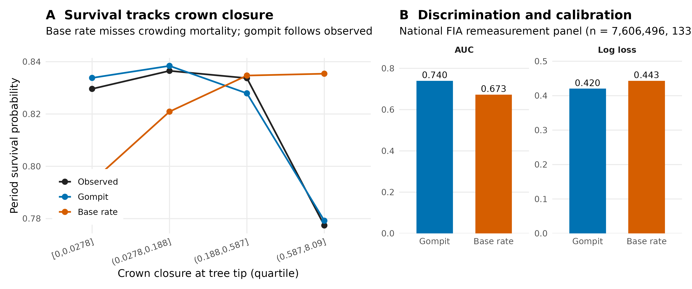

# Gompit mortality model validation

Model-level validation of Greg Johnson's gompit survival against a per-species
base survival rate, on the held national FIA remeasurement panel. This is a pure
prediction check (no FVS engine), so there is no growth or density-feedback
confound. Generated by `calibration/R/40_gompit_mortality_validation_figure.R`
from `compare_new_mortality.R` outputs.

## Headline numbers (n = 7,606,496 tree records, 133 species)

| metric | gompit | base rate |
|--------|-------:|----------:|
| AUC (discrimination) | 0.740 | 0.673 |
| log loss (calibration) | 0.420 | 0.443 |
| mean predicted survival | 0.820 | 0.821 |
| observed survival | 0.819 | 0.819 |

131 of 133 species improved over their base rate (total NLL 3.20M vs 3.37M).

## The crown-closure signal

Survival by crown closure at tree tip (cch) quartile:

| cch quartile | observed | gompit | base rate |
|--------------|---------:|-------:|----------:|
| [0, 0.028]      | 0.830 | 0.834 | 0.794 |
| (0.028, 0.188]  | 0.837 | 0.838 | 0.821 |
| (0.188, 0.587]  | 0.834 | 0.828 | 0.835 |
| (0.587, 8.09]   | 0.777 | 0.779 | 0.835 |

In the most crowded quartile observed survival drops to 0.777; gompit predicts
0.779 almost exactly, while the per-species base rate stays flat at 0.835 and
entirely misses crown-closure-driven mortality. This is the prediction gain the
gompit covariates (crown ratio + crown closure at tip) buy.

## Scope and caveat

This validates the mortality model as a predictor on real remeasurement data.
It is **not** a projection-level biomass result. Substituting gompit for FVS
native mortality inside a projection is not yet valid wiring (disabling FVS
mortality makes FVS growth unrealistic); see
`calibration/python/GOMPIT_INTEGRATION_FINDINGS.md` for the projection-side
diagnosis and options.
