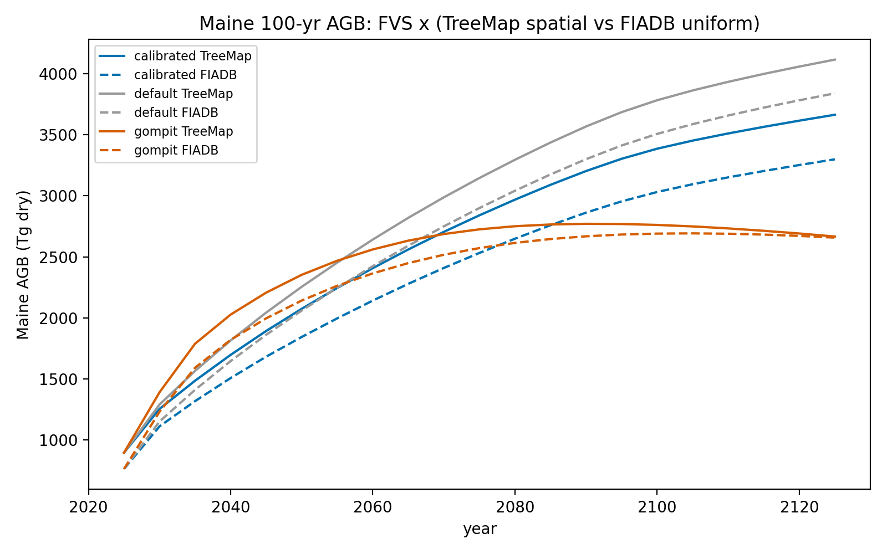

# Maine TreeMap pilot: spatially-explicit FVS, FIADB vs TreeMap, 3 engines

First spatially-explicit FVS result, decoupled from the CONUS campaign. Projects
the Maine forest 100 yr (no harvest) and compares two area-expansion choices with
three FVS growth/mortality engines.

## Method

* **Stage A** clip TreeMap2022 to Maine -> 3,578 donor FIA plots covering 6.78M
  forested ha (75.3M 30 m pixels); `TM_ID -> PLT_CN` join.
* **Stage B** FVS on those 3,578 plots, treeinit from **TreeMap's own tree table**
  (the imputed donor tree list -- the self-consistent source), 3 engines:
  default, calibrated (Bayesian), gompit (national mortality).
* **Stage C** aggregate Maine AGB/AGC two ways, isolating the area choice:
  TreeMap spatial (sum density x actual pixel area) vs FIADB uniform
  (mean density x total area).

## Result 1 -- FIADB vs TreeMap (the area-expansion effect)

| | 2025 | 2075 | 2125 |
|---|---:|---:|---:|
| TreeMap AGB (Tg) | 894 | (cal) 2840 | 3665 |
| FIADB AGB (Tg)   | 761 | (cal) 2532 | 3300 |
| **TreeMap / FIADB** | **1.175** | 1.122 | 1.111 |

At present, **TreeMap-spatial Maine AGB is ~17.5% above the FIADB-uniform
estimate** (894 vs 761 Tg; 132 vs 112 Mg/ha). The high-biomass forest types
occupy disproportionately more landscape area than uniform plot-weighting
assumes -- a spatial composition effect FIADB plot-expansion cannot resolve but
TreeMap reveals. The ratio **converges toward 1.0 over the century** as stands
mature toward carrying capacity (gompit reaches 1.003 by 2125; default 1.072).

## Result 2 -- the three FVS engines diverge strongly (no-harvest)

Maine AGB (Tg, TreeMap expansion):

| engine | 2025 | 2075 | 2125 | behaviour |
|--------|----:|----:|----:|-----------|
| default    | 894 | 3146 | 4117 | over-accumulates (no disturbance/harvest) |
| calibrated | 894 | 2840 | 3665 | calibration moderates growth |
| gompit     | 894 | 2725 | **2667** | **plateaus ~2090 (2771) then declines** |

The national **gompit** mortality is the standout: its density-aware crowding
mortality caps late-succession biomass and even declines in old age (peak ~2771
Tg ~2090 -> 2667 Tg by 2125), the most realistic carbon ceiling of the three.
Default FVS over-accumulates to an implausible 4117 Tg (565 Mg/ha) under passive
succession -- which is exactly why the harvest + disturbance scenarios
(`conus_hcs` + `p_disturbance`) matter for realistic statewide trajectories.

## Feasibility confirmed

The whole pilot is a raster join over the running per-plot FVS compute: 3,578
plots, minutes of FVS (vs a "billion-pixel" run that is not needed). The same
pattern scales to CONUS once the campaign completes. Data: `me_pilot_me_fiadb_vs_treemap.csv`.

## Notes / next

* No-harvest is the upper-bound "potential" trajectory. Coupling the `conus_hcs`
  harvest probability/intensity rasters + `p_disturbance` gives the realistic
  managed/disturbed trajectories for the PERSEUS `managed (harvest)` scenario.
* Pilot pipeline: `me_treemap_stageA_donors.R`, `me_donor_extract.py`,
  `me_donor_fvs.py`, `me_treemap_stageC_compare.py`.
