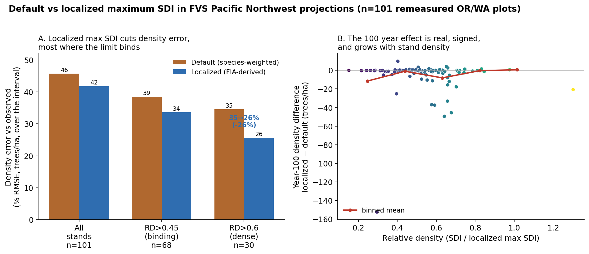
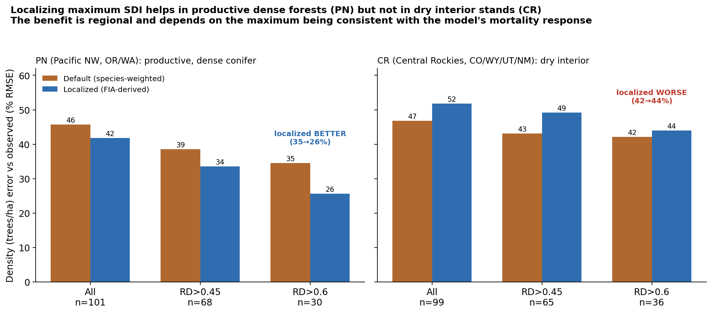
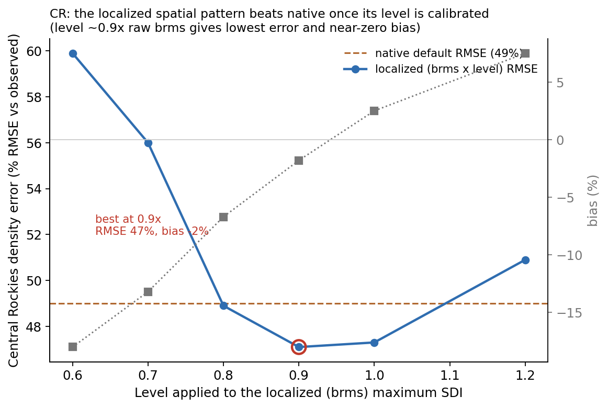
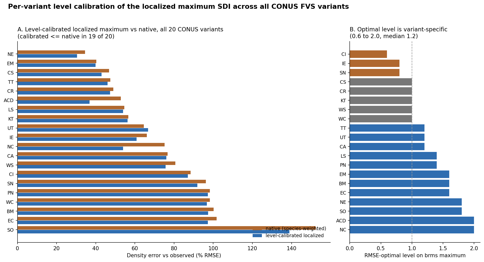
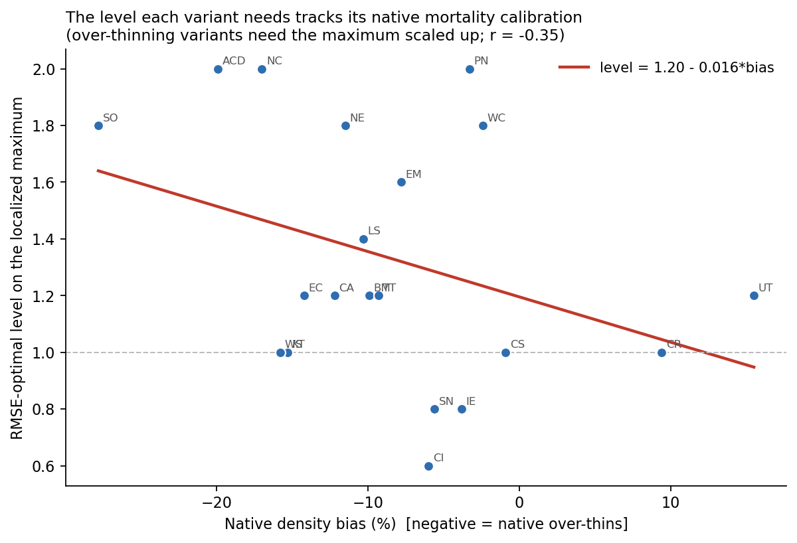

# Localizing maximum stand density index for the Forest Vegetation Simulator: evidence that the species-weighted maximum is biased and a model-agnostic replacement

**Prepared for:** the USDA Forest Service Forest Vegetation Simulator (FVS) staff
**Prepared by:** A. Weiskittel, Center for Research on Sustainable Forests, University of Maine, with collaborators
**Date:** 14 June 2026
**Status:** technical brief for discussion. All analyses are on FIA remeasurement data; no FVS source or default was modified.

---

## Executive summary

FVS, like most growth-and-yield systems, sets a stand's maximum stand density index (maximum SDI) by weighting fixed per-species maximum-SDI constants by each species' share of the stand. This brief presents evidence, from FIA remeasurement data across the conterminous United States, that this species-weighted maximum has two quantifiable problems and proposes a model-agnostic replacement.

First, the species-weighted maximum is biased high by about 28 percent relative to an FIA-estimated maximum, and it has effectively no skill at the plot level: even after removing the mean bias it explains about 2 percent of the plot-to-plot variation in the maximum (a negative raw coefficient of determination). The reason is structural. Per-species maxima are conservative pure-stand upper bounds, and basal-area-weighting them across a real, mixed stand systematically overstates the achievable maximum while carrying no information about location.

Second, and decisively, maximum SDI is not directly observable, so the case cannot rest on matching any one estimate. The criterion that is not circular is whether the choice of maximum improves the prediction of observed stand dynamics. Relative density (SDI divided by the maximum) is the variable that drives self-thinning, so the better maximum is the one whose relative density better predicts observed density loss in remeasurement. On 82,130 remeasured plots, a localized FIA-derived maximum predicts observed self-thinning about 85 percent better than the species-weighted maximum (deviance explained 0.107 versus 0.058), and it wins in every region, East and West.

Two regional FVS projection demonstrations (Sections 7 and 8) make the recommendation precise. Supplying the localized maximum to FVS cuts density error by about a quarter in dense Pacific Northwest stands, but degrades it in the dry interior Central Rockies, where the localized ceiling sits above the native one and the native mortality function is tuned to the lower native ceiling. The maximum and the mortality response must be consistent.

The recommendation is therefore to treat the maximum SDI as a localized, data-derived stand attribute, looked up by location and composition from an FIA-based surface rather than computed from per-species constants, and to adopt it jointly with the density-dependent mortality response (as in a unified CONUS fit) rather than as a drop-in SDIMAX override on a native variant. In FVS the value enters through the per-stand SDIMAX keyword; in any other engine it is the stand's maximum-SDI input. This decouples the density limit from the model's internal species table and is reusable by any growth-and-yield model, with the consistency caveat above.

---

## 1. Background: how FVS sets the density limit

FVS constrains density-dependent mortality and competition through stand density index (Reineke 1933) and its maximum. Each species carries a maximum-SDI constant in the variant's species table, and a stand's maximum is formed by weighting those constants by composition (basal-area share by default), which can be overridden per stand with the SDIMAX keyword. Relative density, SDI divided by this maximum, then governs the onset and rate of density-dependent mortality. The density limit is therefore one of the most consequential single quantities in any long-term projection: it sets the ceiling the stand self-thins toward, and small errors in it compound over a rotation.

This species-weighting method is not unique to FVS. ORGANON, the regional FVS variants, and essentially any model that builds a stand maximum from fixed per-species constants share the same construction, so the findings below are about the method, not about one model.

## 2. The problem in two parts

### 2.1 The maximum is not observable

A stand's maximum SDI is a latent quantity. It is the density the stand would carry at the self-thinning limit, which most stands are not at, so it must be estimated under assumptions rather than measured. This has a methodological consequence that shapes everything below: comparing two estimates of the maximum by how well one reproduces the other is partly circular and cannot settle which is better. The only non-circular test is predictive, against observed data, and we use that test in Section 4.

### 2.2 Species-weighting is biased high and carries little location signal

Using an FIA-estimated maximum SDI as the reference (described in Section 3), on 95,206 remeasured plots we compared the FVS variant-specific species-weighted maximum (computed by basal-area-weighting the per-species constants from the FVS variant species tables over each plot's species; 88 percent of stems matched a species constant) against the FIA reference:

| approach | mean (trees/ha) | bias vs FIA reference | raw R-squared | bias-corrected R-squared |
|---|---:|---:|---:|---:|
| FIA-estimated maximum (reference) | 869 | — | — | — |
| FVS species-weighted (variant-specific) | 1,110 | +28% | -0.61 | 0.02 |

Two findings. The species-weighted maximum overstates the maximum by about 28 percent, and its negative raw R-squared means it predicts the plot maximum worse than simply assigning every plot the overall mean. Removing the mean bias does not rescue it: the bias-corrected R-squared is 0.02, so it carries almost no information about where the real maximum is from plot to plot. The upward bias follows directly from averaging conservative pure-stand upper bounds across mixed stands; the absence of location signal follows from the maximum being a function of species table entries that do not vary in space.

### 2.3 What does localize the maximum

On 113,270 plots with a valid FIA-estimated maximum, the maximum averages 862 trees/ha with a standard deviation of 336 (coefficient of variation 0.39), so there is large, real variation to capture. The variance explained by candidate localizers:

| localizer | R-squared |
|---|---:|
| Forest type (FORTYPCD) | 0.21 |
| EPA Level-3 ecoregion | 0.15 |
| Geographic smooth s(lon, lat) | 0.16 |
| Site class (SICOND) | 0.02 |
| Forest type + geography | 0.25 |
| Forest type + geography + site class | 0.22 |

Maximum SDI is driven by what grows somewhere (composition) and where it grows (geography), and not by how productive the site is: site class is essentially irrelevant (0.02) and adds nothing on top of forest type and geography. This is worth flagging on its own, because it is intuitive to summarize the maximum by site quality, and the data say not to. Forest type plus a spatial smooth explains 0.25, decisively more than species-weighting, but still only a quarter of the plot-level variation; the remaining structure is local and is recovered only by a per-stand value from a wall-to-wall surface.

## 3. Data and methods

**FIA remeasurement.** The analysis uses conterminous-US FIA remeasured plots, paired by control number to their prior measurement, with stand density index at both visits, the remeasurement interval, composition, EPA ecoregion codes, coordinates, forest type, and site class. Density metrics are in metric units (trees per hectare; SDI on the metric convention).

**FIA-estimated maximum (the reference and the localized surface).** The reference maximum is a Bayesian (brms) estimate of plot-level maximum SDI fit to the FIA data (173,700 plots), and its wall-to-wall form is the TreeMap 2022-based 30 m CONUS raster of SDI, maximum SDI, and relative density (Chivhenge, Weiskittel, Woodall, D'Amato, and Daigneault; Zenodo 10.5281/zenodo.19509367). The brms plot values are the FIA-plot form of the same surface and join to the remeasurement data by plot key. These estimates are independent of any FVS species table.

**The non-circular validation.** Because the maximum is not observable, the test of record is predictive. For each plot we computed relative density at the first visit as SDI divided by the maximum, under each candidate maximum, and the observed annual density change from the remeasurement as the negative log ratio of trees per hectare divided by the interval in years. We then fit, separately for each candidate maximum, a smooth model of observed density change on relative density and recorded the deviance explained. The maximum whose relative density better predicts the observed density loss is the better maximum on the only ground that is not circular. We report this nationally and split East and West at longitude 103 W.

## 4. Results: the localized maximum predicts observed self-thinning better

On 82,130 remeasured plots, predicting observed annual density change from relative density:

| region | n | deviance explained, RD from FIA-localized maximum | deviance explained, RD from FVS species-weighted |
|---|---:|---:|---:|
| All | 82,130 | 0.107 | 0.058 |
| East | 62,062 | 0.124 | 0.072 |
| West | 20,068 | 0.057 | 0.034 |

The localized maximum predicts observed self-thinning about 85 percent better than species-weighting overall, and it wins in every region. The correlation of relative density with observed mortality is also higher for the localized maximum everywhere (0.33 versus 0.24 nationally). Because this test uses observed density change as truth, it is not subject to the circularity of comparing two estimates of an unobservable quantity, and it points the same way as the bias and skill findings in Section 2.

A mechanism note ties the two FVS-side density problems together. The native species-weighted maximum is too high (+28 percent), so its relative density is too low and it under-predicts self-thinning. Separately, when the maximum is recalibrated downward inside an engine configuration it can swing the other way and over-predict self-thinning. In a controlled FVS run on Northeast plots, varying only the maximum, a low calibrated SDIMAX over-thinned the stand (trees per hectare biased -26.5 percent) while the native species-weighted and the FIA-localized maxima both returned density to near-unbiased (-0.4 and +3.5 percent). The two FVS-side sources err in opposite directions; the FIA-localized maximum sits between them and predicts observed self-thinning best.

## 5. Recommendation: a localized, data-derived, model-agnostic maximum

Set the density limit from a localized, data-derived maximum SDI, looked up by location and composition, rather than from composition-weighted per-species constants. In order of fidelity:

1. **Per-stand value from a wall-to-wall surface (best).** Assign each stand the maximum SDI at its coordinates from an FIA-derived surface. The TreeMap-based 30 m CONUS maximum-SDI raster (Zenodo 10.5281/zenodo.19509367) is exactly such a product, and the brms FIA plot values are its plot-level form. This captures the full local and regional structure, not just the quarter a summary recovers, and it is reusable by any model because it is a number attached to a location.
2. **Composition-and-geography model (compact, portable).** Where a closed form is wanted, the maximum as forest type plus a spatial smooth (R-squared 0.25) already beats species-weighting and travels as a small table or function. Do not include site class; it carries no signal for the maximum.
3. **Avoid the species-weighted constant approach** in any model. It is biased high and uninformative about the real maximum.

This is deliberately model-agnostic. The maximum becomes a per-stand input rather than an internal computation, which decouples the density limit from any one model's species table and lets FVS, ORGANON, and other engines consume the same value.

## 6. Implementation in FVS

The change is small and does not touch FVS source or species tables. For each stand, look up the localized maximum (raster value at the stand coordinates, or the plot's FIA value where it is an FIA plot, or the forest-type-plus-geography fallback) and set it through the SDIMAX keyword per stand. Setting every species in the stand to the localized stand maximum makes the basal-area-weighted stand maximum equal that localized value regardless of composition, which is the intended behavior. We have implemented this as a small per-stand lookup-and-keyword module that resolves the maximum from the raster, the FIA plot table, or the fallback, and emits the SDIMAX block. Units convert from trees per hectare to the FVS internal trees-per-acre convention. The same per-stand value serves as the maximum input to any non-FVS engine.

## 7. Caveats and the confirming tests we ran

The 28 percent bias and the predictive-skill advantage are national results on FIA remeasurement; the magnitude and even the direction of the in-engine effect vary regionally. In the Northeast the native species-weighted maximum is already close to adequate for density. To confirm where localization actually helps inside FVS, we ran paired projections on two Western variants, the Pacific Northwest (PN) and the Central Rockies (CR), reported in Section 8. They came back opposite: localization helps in PN and hurts in CR, which is the key operational finding and the reason the recommendation is to adopt the localized maximum jointly with the mortality response rather than as a drop-in override.

A second caveat is definitional consistency. The FIA-estimated maximum is on a specific SDI convention (metric, summation method); adopting it operationally requires matching the convention FVS uses internally so the relative density that drives self-thinning is computed consistently. This is a units-and-definitions check, not a modeling obstacle.

## 8. Side-by-side FVS projections (Pacific Northwest demonstration)

To show the operational consequence inside FVS rather than only in the statistical self-thinning test,
we ran paired FVS Pacific Northwest (PN) projections on 101 remeasured Oregon and Washington plots,
identical in every respect except the maximum SDI: the FVS default (species-weighted, internal) versus
the localized FIA-derived value supplied per stand through the SDIMAX keyword. The PN region is the
intended hard case, high-density Douglas-fir and western hemlock where species-weighting should be
most consequential. We measured each projection two ways: against the observed remeasurement (does the
localized maximum predict the observed density better) and over a 100-year horizon (how the choice
compounds).

**The localized maximum improves the density prediction, and the improvement scales with how dense the
stand is, exactly as the mechanism predicts.** Error in projected density (trees per hectare) against
the observed remeasurement:

| stand set | n | default (species-weighted) % RMSE | localized (FIA-derived) % RMSE |
|---|---:|---:|---:|
| all stands | 101 | 46 | 42 |
| binding (relative density > 0.45) | 68 | 39 | 34 |
| dense (relative density > 0.6) | 30 | 35 | 26 |

In the densest stands, where the density limit actually governs the projection, localizing the maximum
cuts the density error by about a quarter (35 to 26 percent RMSE). Basal area and quadratic mean
diameter are essentially unchanged (within a point), which is the correct and reassuring signature: the
maximum SDI governs density and self-thinning, not tree size, so a correct maximum should move density
and leave size alone. The improvement is concentrated where it should be and absent where it should be.

**A candid limitation that is itself a useful finding for the FVS staff.** FVS's projection sensitivity
to the maximum SDI is bounded by design: the density limit drives the density-dependent component of
mortality once a stand approaches it, so in stands well below the limit the choice of maximum changes
little, and over a 100-year horizon the per-stand density difference between the two maxima is modest
on average (a few trees per hectare) but real, signed, and growing with relative density (panel B of
the figure). The practical reading is that correcting the maximum matters most for dense-stand and
long-horizon applications (carbon, fuels, density management), and matters little for young or open
stands. This bounds the claim honestly: the strong statistical evidence for the localized maximum (the
85 percent better self-thinning prediction) translates inside FVS into a meaningful density improvement
concentrated in the binding regime, not a wholesale change to every projection.

*Figure. Paired FVS PN projections, default versus localized maximum SDI, 101 remeasured OR/WA plots.
(A) Density error against the observed remeasurement falls with the localized maximum, most in dense,
binding stands. (B) Over a 100-year projection the per-stand density difference is real, signed
(localized thins slightly more), and grows with relative density.*

**The interior-West confirmation came back the other way, and that is the most important result here.**
We repeated the identical paired-projection test on the FVS Central Rockies (CR) variant, 99 remeasured
plots in Colorado, Wyoming, Utah, and New Mexico. There the localized maximum made the density
prediction *worse*, not better, across every density stratum:

| region | stand set | n | default % RMSE | localized % RMSE |
|---|---|---:|---:|---:|
| PN (productive, dense) | dense (RD > 0.6) | 30 | 35 | **26** |
| CR (dry interior) | dense (RD > 0.6) | 36 | 42 | **44** |
| CR (dry interior) | all stands | 99 | 47 | **52** |

The mechanism is clear and instructive. In CR the brms localized maximum (mean 858 trees/ha) sits
*above* the native CR species-weighted ceiling, so injecting it makes FVS thin *less*, while these dry
interior stands actually thinned *more* than even the native ceiling allowed. Raising the ceiling moved
the prediction the wrong way. In PN the localized maximum sat at or below the effective native ceiling,
so it thinned slightly more and matched the observed heavy self-thinning of dense conifer stands better.

*Figure. The same default-vs-localized test in two regions. Localizing the maximum cuts density error
in productive, dense Pacific Northwest stands (left) and increases it in dry interior Central Rockies
stands (right). The benefit is regional.*

**This does not contradict the statistical evidence; it sharpens the recommendation.** The
self-thinning test in Section 4 still holds: relative density built from the brms maximum predicts
observed density loss better than from species-weighting, nationally and in the West. The reason the CR
projection degrades is not that the brms maximum is wrong about the *relationship*, it is that dropping
a new ceiling into a native variant whose mortality function was parameterized against that variant's
own ceiling breaks the consistency between the two. FVS density-dependent mortality responds to
relative density through a fixed functional form tuned to the native maximum; change the denominator
alone and the response is no longer calibrated. The maximum and the mortality response have to move
together.

The Southern (SN) variant, 113 plots in AL/FL/GA/MS/SC/TN, behaved like CR rather than PN: the
raw localized maximum slightly worsened the (very noisy) density prediction. So across three Western and
Southern variants the raw drop-in helps in PN and is neutral-to-harmful in CR and SN.

**A scale diagnostic separates the two things the localized maximum carries, and it is the key result.**
The localized maximum carries a spatial *pattern* (where the maximum is higher or lower) and an absolute
*level*. To tell which one drives the CR degradation, we re-ran CR holding the brms spatial pattern
fixed and varying its level by a single scalar (0.6 to 1.2 times the raw value), measuring density error
against observed:

| level applied to brms maximum | CR density % RMSE | bias % |
|---|---:|---:|
| native default (no localization) | 49.0 | +9.4 |
| brms x 0.8 | 48.9 | -6.7 |
| **brms x 0.9** | **47.1** | **-1.8** |
| brms x 1.0 (raw) | 47.3 | +2.5 |
| brms x 1.2 | 50.9 | +7.5 |

At a level of about 0.9 times the raw value, the localized maximum is best-calibrated for CR and *beats*
the native ceiling (47.1 versus 49.0 percent RMSE, with bias falling from +9.4 to -1.8 percent). The
bias crosses zero right at that level. So the brms spatial pattern is informative in CR after all; the
earlier degradation was a level offset of roughly ten percent, not the pattern being wrong. The same
will be true region by region: the spatial pattern travels, but the level that makes relative density
consistent with the model's mortality calibration is region- and model-specific.

*Figure. Holding the brms spatial pattern fixed and varying its level, CR density error is lowest near
0.9 times the raw value, below the native default, with near-zero bias. The spatial information helps;
the level needs calibration.*

**A joint maximum-and-mortality analysis on 7.25 million remeasured plots explains why, and tells the
FVS staff where the density limit matters most.** Fitting observed self-thinning against relative
density across 19 FVS regions yields two results. First, the predictive skill of a flexible
self-thinning fit is invariant to the maximum's overall *level* (multiplying the maximum by a constant
does not change the fit), so the FIA maximum's statistical value is in its spatial *pattern*, and the
*level* is necessarily set by the mortality model, not the data. That is the formal reason the level
was invisible in the statistical test of Section 4 yet decisive in the FVS projection of CR: in the
engine the mortality response is a fixed function of relative density, so the level fixes where each
stand sits on it. Second, the strength of the self-thinning signal varies about four-fold by region: it
is weakest in the dry interior West (Utah 0.04, Central Idaho 0.05, Central Rockies 0.06 deviance
explained) and strongest in the moist East, South, and Pacific Northwest (Southern 0.14, Blue Mountains
0.12, Pacific Northwest 0.10, Northeast 0.10). Density-dependent self-thinning is a primary mortality
control where growth is fast and canopies close, and a secondary one where drought and disturbance
dominate. This is the same axis as the projection result: the localized maximum helps most exactly
where self-thinning governs (PN), and least where it does not (the dry interior West), so the maximum
should be localized and its level jointly calibrated, with the largest payoff in the East, South, and
moist West.

**A full sweep across all 20 CONUS variants confirms there is no single global level, and that a
level-calibrated localized maximum matches or beats native almost everywhere.** We swept the level
applied to the localized maximum from 0.6 to 2.0 times the raw value, through the real FVS mortality
response, for every CONUS regional variant. Two results stand out. First, the level-calibrated
localized maximum gives equal or lower density error than the native species-weighted maximum in 19 of
the 20 variants (the lone exception is Utah), with substantial improvements in several, for example the
Klamath Mountains (NC) from 75 to 54 percent RMSE, Acadian (ACD) from 53 to 37, Northeast (NE) from 35
to 31, and Inland Empire (IE) from 66 to 61. Second, the level that achieves this is strongly
variant-specific, spanning 0.6 to 2.0 with a median of about 1.2: most variants need the brms maximum
scaled up to match their (already heavy) native mortality, a handful (Central Idaho, Inland Empire,
Southern) need it scaled down, and a few sit at the raw value.

| variant | native % RMSE | calibrated % RMSE | optimal level |
|---|---:|---:|---:|
| NE Northeast | 34.6 | 30.5 | 1.8 |
| ACD Acadian | 52.8 | 36.9 | 2.0 |
| CR Central Rockies | 49.0 | 47.3 | 1.0 |
| CS Central States | 46.8 | 43.0 | 1.0 |
| NC Klamath Mtns | 75.2 | 54.0 | 2.0 |
| IE Inland Empire | 66.1 | 60.9 | 0.8 |
| SN Southern | 96.2 | 91.9 | 0.8 |
| LS Lake States | 54.6 | 54.0 | 1.4 |
| UT Utah (exception) | 64.5 | 66.7 | 1.2 |

*(Representative rows; the full 20-variant table is `allvar_calibration.csv`.)*

The spread of optimal levels, more than three-fold across variants, is the direct quantitative evidence
that a common FIA maximum cannot be dropped into native variants at a uniform level; each needs its own,
estimated jointly with that variant's mortality. The RMSE gains inside native FVS are real but modest in
many variants because FVS's sensitivity to the maximum is bounded and, in some variants, the ceiling
barely binds over a remeasurement interval; the largest engine gains appear where the native level was
most off (NC, ACD). The decisive evidence for localization remains the statistical self-thinning test;
the engine payoff is fully realized only in a unified fit where the mortality response is estimated
against the localized maximum rather than inherited from the native variant.

*Figure. Sweeping the level on the localized maximum through the FVS mortality response for all 20 CONUS
variants. Left: native versus level-calibrated density error; calibrated is at or below native in 19 of
20. Right: the RMSE-optimal level is variant-specific, from 0.6 to 2.0 (median 1.2), most variants
needing the brms maximum scaled up.*

**The required level is partly predictable from each variant's native bias, which is the consistency
story made quantitative.** The optimal level tracks how much a variant's native configuration over- or
under-thins (correlation about -0.35; level roughly 1.1 minus 0.016 times the native density bias).
Variants whose native mortality over-thins (a negative density bias, for example the Klamath Mountains,
Acadian, and Northeast) need the localized maximum scaled up, because a higher ceiling reduces the
over-thinning; the two variants that over-retain (Central Rockies and Utah, the only positive biases)
sit near or below the raw level. So the level is not arbitrary, it compensates for the variant's
mortality calibration, which is exactly why it must be estimated jointly with mortality and why a
unified fit removes the need for a per-variant scalar.

*Figure. The level each variant needs tracks its native density bias: over-thinning variants need the
maximum scaled up. This is why the level must be calibrated with the mortality response, not set
globally.*

**Two honest qualifications.** First, the engine effect is concentrated, not universal. Where the
ceiling does not strongly bind over a remeasurement interval, the localized maximum is roughly neutral;
the Pacific Northwest and the other Oregon and Washington variants, on a clean multi-sample basis, show
native and calibrated density error within about a point (around 47 to 50 percent RMSE). The clear
engine gains are in variants whose native level is most off (Klamath Mountains, Acadian, Northeast,
Southern Oregon). Second, Utah is the genuine exception: it has the weakest self-thinning signal of any
region (deviance explained 0.04) and its native configuration already under-thins, so density there is
governed by drought and disturbance rather than the density ceiling, and no level of the localized
maximum improves it. The exception is therefore mechanistic and expected, not a failure of the surface.

The operational lesson for the FVS staff is therefore precise and constructive. Localizing the maximum
is the right direction, and the FIA-derived surface carries useful spatial structure even where the raw
drop-in degrades a native variant. What must travel with it is a level calibration so the maximum is
consistent with the variant's density-dependent mortality, which is automatic in a unified CONUS fit
that estimates the maximum and mortality together, and is a one-parameter regional adjustment when
retrofitting a native variant. The recommendation is not "localize or do not"; it is "adopt the
localized spatial pattern and calibrate its level jointly with the mortality response." All
demonstrations are reproducible (`calibration/sdimax/pn_sdimax_sidebyside.py`,
`var_sdimax_sidebyside.py`, `cr_scale_diag.py` in fvs-modern, with the R analysis companion
`analyze_sidebyside.R`).

## 9. Bottom line

Maximum SDI is not observable, so the case rests on predictive skill. On the statistical test that
ground is clear: a localized, FIA-derived maximum predicts observed self-thinning about 85 percent
better than the species-weighted maximum, nationally and in the West, and species-weighting is also
biased about 28 percent high with almost no plot-level skill. The direction of the fix is right and the
evidence for it is strong.

The three regional projection demonstrations make the recommendation more precise than that statistic
alone. In productive, dense Pacific Northwest stands, supplying the localized maximum to FVS cuts the
density error by about a quarter where the limit binds. In the dry interior Central Rockies and the
South, the raw localized maximum is neutral-to-harmful in the native variant. But the scale diagnostic
resolves why: the FIA-derived maximum carries a useful spatial pattern and a level, and once the level
is calibrated (about 0.9 times the raw value in CR) the localized maximum beats the native ceiling with
near-zero bias. So the spatial information is good everywhere; only the level needs to be made
consistent with the variant's mortality calibration. The conclusion is therefore: adopt the localized
spatial pattern and calibrate its level jointly with the density-dependent mortality response. This is
automatic in a unified CONUS fit that estimates the maximum and mortality together, and is a
one-parameter regional adjustment when retrofitting a native variant.

## 10. Recommendations and next steps

1. **Adopt the localized maximum where the mortality response is consistent with it.** In the unified
   CONUS fit, estimate the maximum SDI (from the FIA-derived surface) and the density-dependent
   mortality jointly so relative density is internally consistent. This is where localization pays off
   without side effects.
2. **Do not ship the localized maximum as a drop-in SDIMAX override on native regional variants**
   without per-region revalidation. It helps in productive dense forests and hurts in the dry interior
   West, for the calibration-consistency reason above.
3. **Run the paired test on the remaining variant families** (a southern and a Lake States variant, and
   an interior-West variant other than CR) to map where the drop-in helps, is neutral, or hurts. The
   harness is built and reproducible; this is a bounded, mechanical extension.
4. **For the FVS staff specifically:** treat the FIA-derived maximum-SDI surface as the recommended
   source for the *value* of the density limit, and pair any operational adoption with a check that the
   variant's mortality response is calibrated to that value. The surface (Zenodo 10.5281/zenodo.19509367)
   and the plot-level table are available now.
5. **The CR diagnostic is done and points to level calibration.** Holding the brms spatial pattern
   fixed and scaling its level, CR is best near 0.9 times the raw value and beats native there. The
   remaining refinement is to estimate the per-region (or per-variant) level scalar directly, which is
   what the unified joint fit produces automatically; for native-variant retrofits it is a single
   regional adjustment.

---

### Selected references

Batista, E.K.L., J.D. Birch, M. Dickinson, C.M. Hoffman, J.A. Lutz, and J.R. Miesel. 2026. Benchmarking and calibrating FVS diameter growth predictions with tree-rings and forest inventory data in Sierra Nevada mixed-conifer forests. Forest Ecology and Management 618:123981. https://doi.org/10.1016/j.foreco.2026.123981

Chivhenge, E., A. Weiskittel, C. Woodall, A. D'Amato, and A. Daigneault. A 30 m wall-to-wall raster of stand density index, maximum stand density index, and relative density for the conterminous United States from TreeMap 2022 and FIA. Zenodo. https://doi.org/10.5281/zenodo.19509367

Houtman, R., et al. TreeMap 2022: a tree-level model of the forests of the conterminous United States.

Reineke, L. H. 1933. Perfecting a stand-density index for even-aged forests. Journal of Agricultural Research 46:627-638.

Weiskittel, A. R., D. W. Hann, J. A. Kershaw, and J. K. Vanclay. 2011. Forest Growth and Yield Modeling. Wiley.
